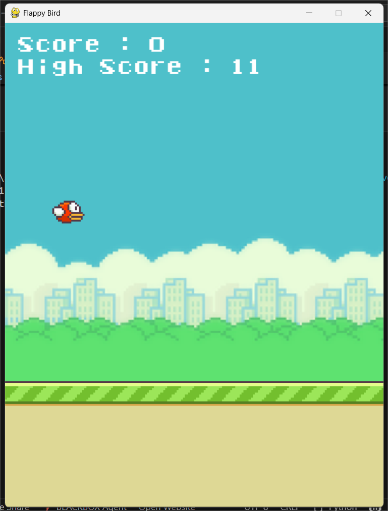

# Flappy Bird Game 🎮🐦

A Python Flappy Bird clone built with Pygame, bringing the classic arcade fun to your desktop. Navigate the bird through pipes, score points, and challenge yourself with increasing difficulty and fun features!

_______________________________________________Features_______________________________________________

Keyboard controls:
    Spacebar → Flap the bird
    P → Pause the game
    N → Toggle Night Mode

Gameplay mechanics:
    Randomly generated pipes
    Mode changes to night after 10 points
    High score saving across sessions
    Game over and restart functionality
    Smooth physics and collision detection

Audio & Visuals:
    Background music & sound effects
    Eye-catching daytime and nighttime themes

Tech Stack 🛠️ :
    Python 3.x
    Pygame for game development

How to Play 🚀 :
    Clone the repo:  git clone https://github.com/<your-username>/FlappyBird.git
                     cd FlappyBird

    Install dependencies:   pip install -r requirements.txt

    Run the game:   python game.py

Press Spacebar to flap, P to pause, N to toggle night mode, and try to beat your high score!

Future Improvements 🔧:
    Touch screen support for mobile devices
    Online leaderboard with API integration
    Multiple levels and bird customization

Screenshots 🖼️: 1. 
                2. 
                3. 

Developed By:   Shabbir Ahamad Molla
                GitHub: https://github.com/Shabbir-Ahamad
                LinkedIn: https://www.linkedin.com/in/shabbir-ahamad-58a504267/
